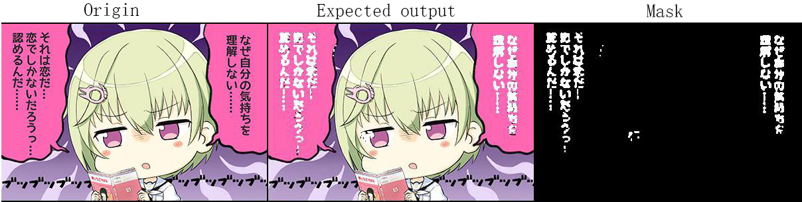

# Text Segmentation and Image Inpainting 

This is an ongoing project that aims to solve a simple but teddies problem: how to remove texts from an image. 

The road ahead is following:
* Detect and mask text from an image
* Use the generated mask as holes to repair the image

## Current Stage

#### Text segmentation

I train several version of Mobile Net V2 with various settings and check points, but none of them works perfect even on my training images. The problem might be the model's size since resnet 50 & 101, which have more than 10x numbers of  parameters, have much better performance records. Another problem is that models are pre-trained on photos from the real word, but my training images are completely different. For example, ImageNet's mean and std (RGB) are [[0.485, 0.456, 0.406] and [0.229, 0.224, 0.225]](https://github.com/tonylins/pytorch-mobilenet-v2/issues/9), but images from [Danbooru2017](https://www.gwern.net/Danbooru2017#rsync), which are similar to my training samples,  have mean [ 0.4935,  0.4563,  0.4544] and std [0.3769,  0.3615,  0.3566].  Transfering learning might not work well [Torralba & Efros, 2011](http://citeseerx.ist.psu.edu/viewdoc/download?doi=10.1.1.208.2314&rep=rep1&type=pdf). Thus, I am training a Mobile Net V2 from scratch on over 100k images from Danbooru2017. I hope it works. ~~Training  resnet 101 is expensive.~~


# Models
Targeted users generally don't have high spec GPUs or CPUs, so I aim to use/customize fast and memory efficient deep neural nets. 

## Text Segmentation 
I customize the [Deep Lab V3+](Encoder-Decoder with Atrous Separable Convolution for Semantic Image
Segmentation). The backbone is [Mobile Net V2](https://www.google.com/search?q=mobile+net+v2&ie=utf-8&oe=utf-8&client=firefox-b-1-ab) and Atrous Spatial Pyramid (ASP) Pooling to extract image features. The decoder simply concatenates the input features with pooled features and up-scales them back to the size of the input image to decide a pixel is a text or not. 

Mobile Net V2 uses [tonylins's PyTorch checkpoint](https://github.com/tonylins/pytorch-mobilenet-v2) and fixed the first 6 layers/bottlenecks . The last two layers are removed, and last two bottlenecks that have output stride of 32 (32x smaller than the input image) are change to 16 by removing the stride and substituting following convolutions by atrous convolution with rate of 2. They are then re-trained. ASP Pooling and decoder follow Deep Lab V3+, but all activations are replaced by SELU, which shows efficient in super resolution in my waifu2x's project.


I don't use a text-detection model such as Textbox Plus Plus, Single Shot MultiBox Detector, or Faster R-CNN because I don't have images that have bounding boxes on text regions. Real world image databases don't fit this project's goal.

To generate training data, I use two copies of images: one is the origin, and the other one is text clean only. These images are abundant and easy to obtain from either targeted users or web-scraping.  By subtracting the two, I get a mask that shows the text region. The idea is inspired by He, etc's  [Single Shot Text Detector with Regional Attention](https://arxiv.org/abs/1709.00138) and He,etc's [Mask-R-CNN](https://arxiv.org/abs/1703.06870). Both papers show a pixel level object detection. 


Notes on training the model:

The model runs less than a second with 80  512x512 images  in Nvidia P-100. The run time bottleneck will probably lay in CPU speed. Try to get more CPUs and large memory when setting ```num_workers``` in PyTOrch's dataloader. 6 workers takes around 10 GB memory. If CPUs are not fast enough to keep GPUs busy, please downscale the input images. The loss scores are similar for both origintal and downscaled version.

I train the model with Focal loss with gamma of 2 and alpha of 0.25, SGD wit Nesterov (momentum is 0.98), batch size is 80, and the learning rate is 0.1 which works surprisingly well until the loss goes to 0.00150. Then the learning rate descreases gradually to 0.008, but the model doesn't improve.

I am trying cross entropy loss with weights.


The model is trained on black/white images, but it also works for color images. 

Example:

* The model has not converged yet after 10 hours of training. 

Source: [Summer Pockets](http://key.visualarts.gr.jp/summer/)

More examples will be added after I obtain authors' consent. 


## Image Inpainting
I have not started this part yet. I plan use the first model to generate more training data for this part.
The model will be a UNet-like architecture, but all convolutions will be swapped by gated partial convolutions. Details can be found in Yu, etc's paper [Free-Form Image Inpainting with Gated Convolution](https://arxiv.org/abs/1806.03589) & [ Generative Image Inpainting with Contextual Attention](https://arxiv.org/abs/1801.07892) and Liu, etc's paper [ Image Inpainting for Irregular Holes Using Partial Convolutions](https://arxiv.org/abs/1804.07723). These papers are very interesting and show promising results. 


