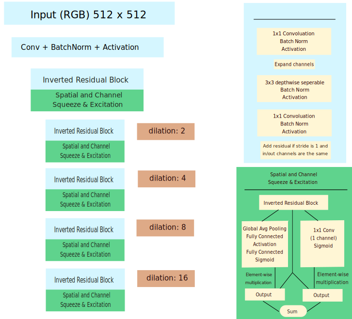
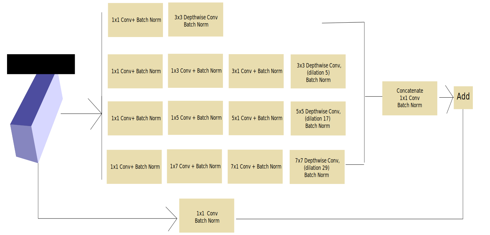
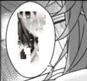
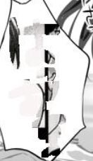
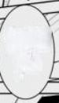
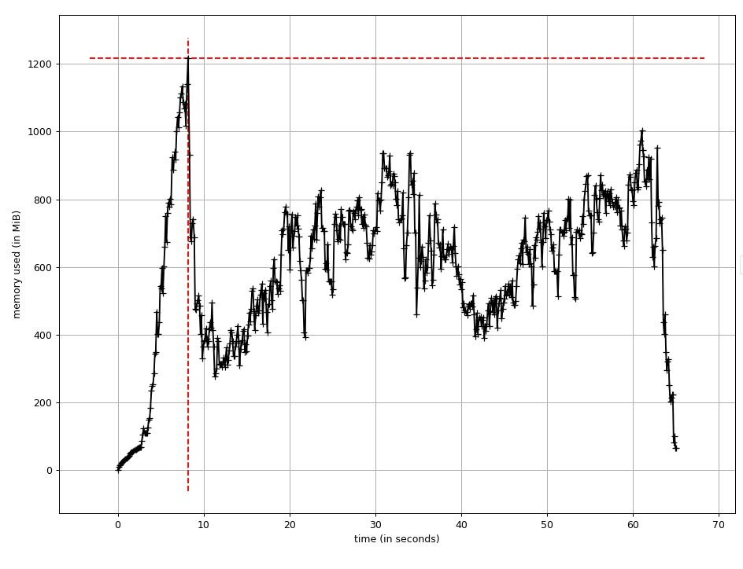

# Text Segmentation and Image Inpainting 

This is an ongoing project that aims to solve a simple but teddies procedure: remove texts from an image. It will reduce commic book translators' time on erasing Japanese words.

The road ahead:
* Detect and generate text mask from an image
* Use the generated mask to white out words
* Apply image inpainting to reduce color inconsistancy.

# Usage
Please see the "Examples" folder


# Models
Targeted users generally don't have high spec GPUs or CPUs, so I aim to use/customize fast and memory efficient deep neural nets that can run on CPU only environment. 

## Text Segmentation
The model contains three parts: encoder, feature pooling, and decoder.

### Encoder
The backbone is [Mobile Net V2](https://www.google.com/search?q=mobile+net+v2&ie=utf-8&oe=utf-8&client=firefox-b-1-ab), and I append a [Spatial and Channel Squeeze & Excitation Layer](https://arxiv.org/abs/1803.02579). The original model has width multiplier of 1, and I change it to 2. The number of parameters in the convolution part doubles, but the run time increases from 3 seconds to 7 seconds. In addition, I replace the outstride 16 and 32 blocks to dilatation to enlarge field of view ([DeepLab V3](https://arxiv.org/abs/1706.05587), [DeepLab V3+](https://arxiv.org/abs/1802.02611)) .

* There are some minor differences from the [current implementation](https://github.com/yu45020/Text_Segmentation_Image_Inpainting/blob/master/models/MobileNetV2.py#L20). I will update the model illustrations later. 



### Feature Pooling
The model is [Receptive Field Block (RFB)](https://arxiv.org/abs/1711.07767). It is similar to DeepLab v3+'s Atrous Spatial Pyramid (ASP) pooling, but RFB use separable convolution ([Effnet](https://arxiv.org/abs/1801.06434)-like without pooling) with larger kernel size (I choose 3,5,7) followed by atrous convolution. 




### Decoder
Deocder follows Deeplab V3+: features are up scaled x2 and concatenated with 1/4 encoder features, and then they are up-scaled back to the same size of input image. 

##
I don't use a text-detection model such as Textbox Plus Plus, Single Shot MultiBox Detector, or Faster R-CNN because I don't have images that have bounding boxes on text regions. Real world image databases don't fit this project's goal.

To generate training data, I use two copies of images: one is the origin image, and the other one is text clean. These images are abundant and easy to obtain from either targeted users or web-scraping.  By subtracting the two, I get a mask that shows the text region. Applying a max pooling on the mask is better because regions around texts will also be erased out. By experiment, on a 512x512 image, max pool with kernel size 7, stride 1, and padding 3 is the best. 

The idea is inspired by He, etc's  [Single Shot Text Detector with Regional Attention](https://arxiv.org/abs/1709.00138) and He,etc's [Mask-R-CNN](https://arxiv.org/abs/1703.06870). Both papers show a pixel level object detection. 

##

The model is trained on black/white images, but it also works for color images. 

Example:

* The model has not converged yet after 10 hours of training. 

Source: [Summer Pockets](http://key.visualarts.gr.jp/summer/)

More examples will be added after I obtain authors' consent. 


## Image Inpainting
The model structure is  U-Net like, but all convolutions are replaced by the partial convolution from Liu, etc's paper [Image Inpainting for Irregular Holes Using Partial Convolutions](https://arxiv.org/abs/1804.07723), which is similar to a weighted convolution with respect to image holes. 

My implementation is  influenced by [ Seitaro Shinagawa's codes](https://github.com/SeitaroShinagawa/chainer-partial_convolution_image_inpainting/blob/master/common/net.py). However, due to heavy indexing in partial convolution, it becomes the bottleneck. For example, I use depth-wise separable convolutions instead of standard convolutions, but I find it consumes a lot more memory and runs 2x slower. The culprit is in ```torch.where``:

```
update_holes = output_mask > 0
mask_sum = torch.where(update_holes, output_mask, torch.ones_like(output))
output_pre = (output - output_bias) / mask_sum + output_bias
output = torch.where(update_holes, output_pre, torch.zeros_like(output))
```
(I am interested in finding a more efficient way to implement partial convolution.)

I also find something very interesting during training. In the early stages, the model can generate or find some parts of a image to fill in holes. For example, images below have holes replacing text inside polygons. In the left and the middle image, the model find some parts of the image to fill the holes; in the right image, the model generates a manga-like framework inside the hole. 





As a comparison, I also train a model with [depth-wise separable partial convolutions ](https://github.com/yu45020/Text_Segmentation_Image_Inpainting/blob/4904cf0c9a59743bce595482ab8c2905faea683a/models/image_inpainting.py#L9) but fail to find similar results.
Instead, that model will generate some blurring patches on the hole like this one:

 

##### Notes on gated convolution:
I implement the gated convolution from Yu, etc's paper [Free-Form Image Inpainting with Gated Convolution](https://arxiv.org/abs/1806.03589). The main idea is to update the mask by a sigmoid rather than harding setting it to 1 or 0. I am not able to train the model with GAN in short time since I am renting GPUs. But if I replace the loss function with the one from the partial convolution, the model converges. 

However, I am concerned with the model performance. Gated convolution has a lot more parameters from the convolutions on masks. The partial convolution has no learnable parameters  on masks. I am wondering the model is easier over-fitting the training data. 

In addition, I am not able to comprehend the implantation. According the author's [comment](https://github.com/JiahuiYu/generative_inpainting/issues/62#issuecomment-398552261), the gated convolution looks like this: 

```
x1 = self.conv1(x)
x2 = self.conv2(x)
x = sigmoid(x2) * activation(x1)

# or more GPU efficient way:
x = self.conv(x)
x1, x2 = split(x, 2) # split along channels 
x = sigmoid(x2) * activation(x1)
``` 

The mask and input image are [concatenated and sent into the model](https://github.com/JiahuiYu/generative_inpainting/blob/06cd62cfca8c10c349b451fa33d9cbb786bfaa20/inpaint_model.py#L42). One problem is that if a mask has one channel and a image has three, then as convolutions go deeper, the mask has far less weigh than the image. Splitting a feature map equally may give incorrect weights. On the other hand, even if the mask has same channel as the input image, standard convolutions will connect both of them during training. Information will travel through all channels, so splitting feature maps by half may break the information flow. Using depth-wise separable convolution may solve this issue, but the problem remains: why half of them are from mask. 

I am searching an alternative based on this one. The main idea comes from LSTM's attention mechanism. I use separated convolutions on input image and binary mask. The binary mask has 1 for valid pixel and 0 for hole. By reversing the label, its convolution outputs have 0 on all valid pixels while some weights on holes positions. Applying tanh and multiply to the input feature map will look like attention on images' holes. It is similar to partial convolution which gives more weights on holes. But I have not find an efficient way to update the mask. Comments and suggestions are welcome.     


## Current Stage
#### Text segmentation

I train several versions of Mobile Net V2 with various settings and pre-trained check points, but none of them works perfect even on my training images. The problem might be the Mobile Net V2's size.  ResNet 50 & 101, which have more than 10x numbers of  parameters, have much better performance records. 

Another problem is that models are pre-trained on photos from the real word, but my training images are completely different. For example, ImageNet's mean and std (RGB) are [[0.485, 0.456, 0.406] and [0.229, 0.224, 0.225]](https://github.com/tonylins/pytorch-mobilenet-v2/issues/9), but images from [Danbooru2017](https://www.gwern.net/Danbooru2017#rsync), which come close to my training samples,  have mean [ 0.4935,  0.4563,  0.4544] and std [0.3769,  0.3615,  0.3566].  Transfer learning might not work well ([Torralba & Efros, 2011](http://citeseerx.ist.psu.edu/viewdoc/download?doi=10.1.1.208.2314&rep=rep1&type=pdf)). 


##### July 10th
I implement a naive one-vs-all binary CNN model that treats each label as independent. The error rate is unsurprisingly terrible. I then implement a [CNN-LSTM model](https://arxiv.org/abs/1711.02816)  which recurrently finds attention regions and detects labels. Such approach is bounding-box free and similar to one-stage detection such as SSD.

Given the official code has not been released yet, I take my freedom to tweak and change model details: the paper uses fully connected layers in between feature maps and LSTM, and its lost function contains 4 anchor distance loss. 

I  use global average pooling to send concatenated feature maps into LSTM and let it learn the residual parts of anchor position, which means LSTM predicts the distance away from the anchor points. That makes the LSTM part looks around the image. In addition, in the loss function, I add bounding constrain on the spatial transform matrix (its horizontal absolute sum <=1 ) so that attention regions will be inside the image and not be zero padded. That makes my global pooling effective. 

##### July  13th 
Training on [Danbooru2017](https://www.gwern.net/Danbooru2017#rsync) is completed. I select the top 500 labels from descriptive tags and 113K images that have the most tags. Each training sample has at least 20 tags, and the top 1,000 images have more than 100 tags. The model is trained on Nvidia-V100 for over 20 hours with cyclical learning rate. One epoch takes around 1.5 hours. Since the goal is transfer learning, I stop training before the model converges. 

 ##### July 14th 
 Training on text segmentation is completed. Training takes 2 stages: I freeze the encoder in the first stage and monitor the performance on the  validation set. Before the model over-fits the training samples, I then re-train all parameters. 
 
 I have only 2k training images, but the model performance seems acceptable. I need to collect more data since the model is over-fitting the samples. 

Memory usage: 4 CPUs and 8 images.
 
 
 
## Notes on Hyper-parameters 
* Cyclical learning rate is a great tool but needs to pick optimal base & max learning rate. Learning rate range can be as large as 0.1-1 with few epochs ([Exploring loss function topology with cyclical learning rates](https://arxiv.org/abs/1702.04283)).
* Weighted binary cross entropy loss may be better than focal loss. 

With cyclical learning rate from 1e-4 ~ 1e-2, and 100 iterations on 200 images.

|         | AP score (validation images)   |
| ------------- |:-------------:| 
| Gamma  0, Background:1, words:2     | **0.2644** | 
| Gamma  .5, Background:1, words:2     | 0.2411 | 
| Gamma  1, Background:1, words:2     | 0.2376 | 
| Gamma  2, Background:1, words:2     | 0.2323 | 
| Gamma  0, Background:1, words:1     | 0.2465 | 
| Gamma  1, Background:1, words:1     | 0.2466 | 
| Gamma  2, Background:1, words:1     | 0.2431| 
| Gamma  0, Background:1, words:5     | 0.2437 | 

* Weight decay should be smaller than 1e-3. 1e-4 is better than 1e-5 when use cyclical learning rate and SGD (with nesterov). 


 ##### July 24th 
Training the partial convolution. 


### Difference on Up-sampling 
* bilinear up-sample


* transpose convolution


* pixel shuffling 

